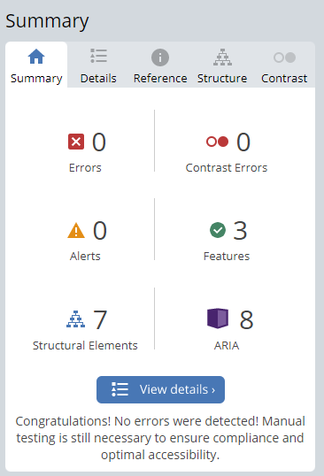

# Kids Play Club

Kids Play Club website was created to fulfil most everyday parents needs for their children. As a parent living in Ireland, I know the struggles of finding activities for our children to do during the summer while we have to work. Then we still have the issue on trying to find childcare for our kids. Based on the needs or like to have requirements the Kids Play Club site was created. [here](https://desousamario85.github.io/kids_club/)

## Site Across Devices


## Features 

### Navigation Menu
* Contains anchors to the top of the page, About us and Services and Contact Us sections on the web page.
* Users can easily navigate through to any section on the site as the Navigation is in a fixed position.
* Pure CSS Hamburger menu was implemented for mobile devices. The menu closes automatically when navigation anchor is selected

**Desktop Navigation**


**Mobile Navigation Icon**


**Mobile Navigation**


There is a back to Top button which allows to navigate back to the top of the site.

**Back to Top**


### Footer
    
* The footer contains all the common social media weblinks. They are place holders, and they only navigate to the each social media platform land page.

**Footer**


* Favicon
    * Following common practices and is visible in almost every website, is an icon in the address bar, which can be the company’s logo or Text.
    * For the Kids Play Club I used the first letter of each word to have the favicon created.

**Favicon**


* 404 Page
    * 404 pages are a great way to tell the users that they have navigated to a broken link and still keep them on your site.
    * Keep users on your site when they navigate to a broken link, allows the user to go back to the Home Page of the site.
    * This prevents user leaving your site and leaving the impression that the site is broken or down.


### Landing Page

The landing page or the top of the site is diplaying kids playing with kite like material, this was to demostat to the visitors that the club is all about having fun.


### About Us

The About section provides insights to the users about the Kids Play Club and what they have to offer and why they should consider bring their kids to our club.


### Services

Under each provided services , I have created a pop up modal, where the user can get more details on the selected services.


Below are the List of services with their images of the modals.

#### Summer Camp


#### Outdoor Sports


#### Arts and Craft


#### Swimming Class


#### School Aftercare


#### Music Lessons


### Contact US

On our Contact Us section, I have the operating hours for the services and a contact form, should the user wish to get incontact with us.


* A contact form will be implemented to allow users to contact Kids Play Club. The following inputs will be required by the user.
    * First Name (required, type=text)
    * Last Name (required, type=text)
    * Email (required, type=email)
    * Services Required (required, type=select)
    * Sign up to our weekly newsletter
    * When the user click on  "Send Enquiry" they will be navigated to Code Institute

    **Successful submission**

     

### Existing Features

Features that exist in this current project are listed below
 
 * Modal pop up (CSS and HTML only)
 * Mobile hamburger menu (CSS and HTML Only)
 * Responsive to mobile devices
 * CSS Animation
 

### Features Left to Implement

As this is a service that does not exist or is not offered and the site only built for Project purposes only the site functionality will remain the same.

Future Improvement will be focused around the overall Design of the site.

## Technologies

* HTML
    * HTML as used as 1 of the primary languages to code the site. This provided our content to be in a structured manner.
* CSS
    * CSS stylesheet was used to style our website.
* GitPod
    * A GitPod Workspace was used to code the website. Using Code Institute GitHub Template some other predefined technologies are installed to allow developers to integrate to Git for versioning and Python3 for http Server to preview our work before committing to GitHub. I have only named 2 integrations, but the Template does include 8 or more addition extensions.
* GitHub
    * Github was used to store our committed Source Code and have a live website using GitHub Pages.
* Git 
    * Version control, integrated with GitPod
* Font Awesome
    * Font Awesome icons were obtained using free registered account https://fontawesome.com/
* Tinyjpg
    * https://tinyjpg.com/ was used to reduce the size of the images used throughout the website
* Favicon.io
    * favicon files were created at https://favicon.io/favicon-generator/
* CSS Clean-up
    * https://html-cleaner.com/css/ was user to clean up my CSS file to ensure the layout was consistent.

### Testing
 
For testing the reponsiviness of the site, I used Chrome Developer Tool to resize the window from 1920px down 320px. Then same steps were applied with 50% zoom on the page. 

The site was testing on following mobile devices on Developer Tools

* iPhone SE
* Pixel 5
* Surface Pro 7
* Samsung Galazy A51/71

The site was also tested on different browsers. Lambdatest.com was used to test Firefox and Safari browsers.
Safari was running on MacOS Mojave version during the tests.

* Google Chrome
* Edge
* FireFox
* Safari

### Validator Testing 

Various validating tools were used to test the site, which can seen on the reports below.

#### Lighthouse Reports

##### Home Page report


##### 404 Page report


#### w3 Validator

##### Home Page report


##### 404 Page report


#### Jigsaw CSS Validator


#### Accessibility

Wave Evaluation tool was used to check and validate if I had any Accessibility issues

##### Homepage Wave Report


##### 404 Wave Report



### Unresolved Bugs

The webiste is responding great to the variuos mobile and desktop browsers. On the Mobile device the "X" in the mobile device has a line running through it when hovered over. This will be resolved on the next update of the website, when we start introducing more technologies to the site.

## Deployment

### Versioning

The site was created using the GitPod workspaces which had Git installed part of it's extentions.

Git commands were used to push through our code to Github, which can be seen below.

``` git add <filename> ``` This command was used to add the file(s) to the staging area before they are committed.
Most of the time ``` git add . ``` was used to stage the files for committing

``` git commit -m “commit message” ``` This allows us to commit our changes to the local repository
```git push``` pushes our code to GitHub to be published to our live site on Github Pages 

#### Deployment to Github Pages

The site was deployed to GitHub pages. The following steps were used to deploy the site.

1. In the GitHub repository, navigate to the Settings tab

2. From the menu on left select 'Pages'
3. From the source section drop-down menu, select the Branch: main
4. Click 'Save'
5. A live link will be displayed in a green banner when published successfully.


### Content 

All written content on the site is my own is based on services that ,as a parent would like to see offered in 1 central location.

### Media

All Images on the site were provided and freely available on the listed sites below.

* https://www.pexel.com
* https://iconscout.com/illustrations/404-error
* Photo by <a href="https://unsplash.com/@artem_kniaz?utm_source=unsplash&utm_medium=referral&utm_content=creditCopyText">Artem Kniaz</a> on <a href="https://unsplash.com/s/photos/children-playing?utm_source=unsplash&utm_medium=referral&utm_content=creditCopyText">Unsplash</a>

### Credits

Thanks to all forum contributors on the listed weblink which helped me code or resolve issues during the project. Their sample code or explanation helped me to include or add the functions on the website that I wanted.

* https://getpublii.com/blog/one-line-css-solution-to-prevent-anchor-links-from-scrolling-behind-a-sticky-header.html
* https://www.sliderrevolution.com/resources/css-modal/
* https://stackoverflow.com/questions/37738278/how-to-create-an-hours-of-operation-list-with-html-and-css

To my mentor Daisy for providing a ReadMe Template , produced by Gareth-McGirr.
