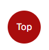

# Kids Play Club

Kids Play Club website was created to filful most everyday parents needs for their children. As a parent living in Ireland, I know the struggles of finding activities for our children to do during the summer while we have to work. Then we still have the issue on trying to find childcare for our kids. Based on the needs or like to have requirements the Kids Play Club site was created. [here](https://desousamario85.github.io/kids_club/)

## Site Across Devices

## Features 

### Navigation Menu
    * Contains anchors to the top of the page, About us and Services and Contact Us sections on the web page.
    * Users can easily navigate through to any section on the site as the Navigation is in a fixed position.
    * Pure CSS Hamburger menu was implement for mobile devices. The menu closes automatically when navigation anchor is selected
    * There is a back to Top button which allows to navigate back to the top of the site.

**Desktop Navigation**

**Mobile Navigation Icon**

**Mobile Navigation**

**Back to Top**

### Footer
    
    * The footer contains all the common social media weblinks. They are place holders and they only navigate to the each social media platform landpage.

**Footer**

* Favicon
    * Following common practices and is visible in almost very website, is a icon in the address bar, which can be the companies logo or Text.
    * For the Kids Play Club I used the first letter of each words to have the favicon created.

**Favicon**

* 404 Page
    * 404 pages are a great way to tell the users that they have navigated to a broken link and still keep them on your site.
    * Keep users on your site when they navigate to a broken link, allows the user to go back to the Home Page of the site.
    * This prevents user leaving your site and leaving the impression that the site is broken or down.

### Landing Page
* Landing page image
    * This will be a collection of favourite images from some of 'Taco's Travels. Images will change on a timer. 
    * This will help to immediately show the user what the website is about and help to animate the page. 

* Website information on 'Taco'
    * Information about 'Taco' and the websites purpose including an image of 'Taco' on his travels.
    * This information lets the user know what the site is about. 

### About Us

### Services

### Contact US

    * A contact form will be implemented to allow users to contact Kids Play Club. The following inputs will be required by the user.
        * First Name (required, type=text)
        * Last Name (required, type=text)
        * Email (required, type=email)
        * Services Required (required, type=select)
        * Sign up to our weekly newsletter
    * When the user click on  "Send Enquiry" they will be navigated to Code Institute

    **Successful submission**

     

### Existing Features

* Responsive design
* Hidden interactive sections on adventure page
* Responsive gallery with filtering
* Contact form and success page
* 3 Adventure trips and information

### Features Left to Implement

* As a future enhancement, the contact form will be updated with javascript to send an email to Taco with the contact information.

* Google map interaction to be added to the Adventures page instead of screen shots of the map.

## Technologies

* HTML
    * HTML as used as 1 of the primary langauges to code the site. This provided our content to be in a structured manner.
* CSS
    * CSS stylesheet was used to style our website.
* GitPod
    * A GitPod Workspace was used to code the website. Using Code Institute GitHub Template some other prefined technologies are installed to allow developers to intagrate to Git for versioning and Python3 for http Server to preview our work before committing to GitHub. I have only named 2 intragations, but the Template does include 8 or more addition extensions.
* GitHub
    * Github was used to store our commited Source Code and have a live website using GitHub Pages.
* Git 
    * Version control, intagrated with GitPod
* Font Awesome
    * Font Awesome icons were obtained using free registered account https://fontawesome.com/
* Tinyjpg
    * https://tinyjpg.com/ was used to reduce the size of the images used throughout the website
* Favicon.io
    * favicon files were created at https://favicon.io/favicon-generator/
* CSS Cleanup
    * https://html-cleaner.com/css/ was user to clean up my CSS file to ensure the layout was consitent.

